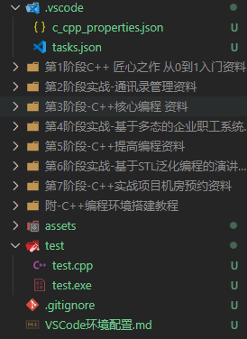

## 1. c_cpp_properties.json（编译器路径和 IntelliSense 设置）
VScode C++扩展程序会根据当前系统环境配置基本信息，因此有可能配置不完整，这时需要通过生成`c_cpp_properties.json`文件来配置缺少的信息：

`ctrl+shift+P`打开Command Palette,运行`C/Cpp: Edit configurations...`生成`c_cpp_properties.json`


生成的结果如下：

```json
{
    "configurations": [
        {
            "name": "Win32",
            "includePath": [
                "${workspaceFolder}/**"
            ],
            "defines": [
                "_DEBUG",
                "UNICODE",
                "_UNICODE"
            ],
            "windowsSdkVersion": "10.0.19041.0",
            "compilerPath": "C:/Program Files/Microsoft Visual Studio/2022/Community/VC/Tools/MSVC/14.32.31326/bin/Hostx64/x64/cl.exe",
            "cStandard": "c17",
            "cppStandard": "c++17",
            "intelliSenseMode": "windows-msvc-x64"
        }
    ],
    "version": 4
}
```

## 2.构建应用程序

`Ctrl+Shift+P` -> `Tasks: Configure Default Build Tasks` -> `Create tasks.json file from templates -> Others.

配置默认生成任务选项


根据已有的编译器生成默认任务


```json
{
	"version": "2.0.0",
	"tasks": [
		{
			"type": "cppbuild",
			"label": "C/C++: g++.exe 生成活动文件", // 该label值是您将在任务列表中看到的；你可以随意命名它。
			"command": "G:\\SOFTWARE\\mingw64\\bin\\g++.exe",
			"args": [
				// 此任务告诉 g++ 获取活动文件 (${file})，对其进行编译，
				// 并在当前目录 (${fileDirname}) 中创建一个与活动文件同名但扩展名为 .exe 的可执行文件 
				// ($ {fileBasenameNoExtension}.exe)，生成示例中的 helloworld.exe。
				// 相当于指令g++ -g helloworld.cpp -o helloworld.exe
				"-fdiagnostics-color=always", // 错误时彩色警告
				"-g",
				"${file}",
				"-o",
				"${fileDirname}\\${fileBasenameNoExtension}.exe" // 定义.exe存放路径，与.cpp文件同级
			],
			"options": {
				"cwd": "${fileDirname}"
			},
			"problemMatcher": [
				"$gcc"
			],
			"group": {
				"kind": "build",
				"isDefault": true
			},
			"detail": "编译器: G:\\SOFTWARE\\mingw64\\bin\\g++.exe" // 该detail值是您将在任务列表中作为任务描述的值。强烈建议重命名此值以将其与类似任务区分开来。
		}
	]
}
```


## 3.launch.json

当您使用播放按钮或F5进行调试时，C++ 扩展会即时创建动态调试配置。

在某些情况下，您希望自定义调试配置，例如指定要在运行时传递给程序的参数。`launch.json`您可以在文件中定义自定义调试配置。

要创建，请从播放按钮下拉菜单中`launch.json`选择**添加调试配置。**


然后，您将看到各种预定义调试配置的下拉列表。选择**`C/C++：g++.exe 构建和调试活动文件。`**

生成的`launch.json`如下：

```json
{
    "configurations": [
        {
            "name": "C/C++: g++.exe 生成和调试活动文件",   // 显示在vscode左侧运行和调试界面的名字
            "type": "cppdbg",
            "request": "launch",
            "program": "${fileDirname}\\${fileBasenameNoExtension}.exe", // 指定要调试的程序
            "args": [],               // 在运行时传递给程序的参数数组
            "stopAtEntry": false,     // 默认情况下不添加任何拓展，设置为true时，在main方法时停止
            "cwd": "${fileDirname}",
            "environment": [],
            "externalConsole": true,  // 是否打开外部控制台
            "MIMode": "gdb",
            "miDebuggerPath": "G:\\SOFTWARE\\mingw64\\bin\\gdb.exe",  // 编译器路径
            "setupCommands": [
                {
                    "description": "为 gdb 启用整齐打印",
                    "text": "-enable-pretty-printing",
                    "ignoreFailures": true
                },
                {
                    "description": "将反汇编风格设置为 Intel",
                    "text": "-gdb-set disassembly-flavor intel",
                    "ignoreFailures": true
                }
            ],
            "preLaunchTask": "C/C++: g++.exe 生成活动文件"
        }
    ],
    "version": "2.0.0"
}
```


## 4.VSCode变量说明



工作空间为`D:/source/C++`，以`task.json`为例， vscode 中变量含义如下：

- `${workspaceFolder}`：表示当前工作空间文件夹路径，也即`D:/source/C++`
- `${workspaceRootFolderName}`：表示工作空间的文件夹名，也即`C++`
- `${file}`：文件自身的绝对路径，也即`D:/source/C++/.vscode/tasks.json`
- `${relativeFile}`：文件在workspace中的路径，也即`.vscode/tasks.json`
- `${fileBasenameNoExtension}`：当前文件的文件名，不带后缀，也即`tasks`
- `${fileBasename}`：当前文件的文件名，`tasks.json`
- `${fileDirname}`：文件所在的文件夹路径，也即`D:/source/C++/.vscode`
- `${fileExtname}`：当前文件的后缀，也即`.json`
- `${lineNumber}`：当前文件光标所在的行号
- `${env:PATH}`：系统中的环境变量

### 如何知道变量的实际值？

检查变量运行时值的一种简单方法是创建一个 VS Code任务以将变量值输出到控制台。例如，要查看 的解析值${workspaceFolder}，您可以在 中创建并运行（终端>运行任务）以下简单的“回显”任务tasks.json：

```json
{
  "version": "2.0.0",
  "tasks": [
    {
      "label": "echo",
      "type": "shell",
      "command": "echo ${workspaceFolder}"
    }
  ]
}
```

## 5.导入第三方库

### 1.配置c_cpp_properties.json

首先在`c_cpp_properties.json`的`includePath`中添加库对应的include目录，并在`browse.path`中添加库对应的lib目录。

- 如果库只包含头文件，只要到导入头文件对应的路径即可
- 如果库有.lib用于静态连接，需要在browse中添加lib目录

```json
{
    "configurations": [
        {
            "name": "Win32", //标识配置的友好名称。Linux, Mac, 和Win32是将在这些平台上自动选择的配置的特殊标识符。
            "includePath": [
                "${workspaceFolder}/**", // 默认包含工作区的所有头文件
                "D:\\ceres\\sophus\\Sophus", // 导入第三方库的include目录，也可以添加.h头文件
                "D:\\ceres\\eigen-3.4.0",
                "D:\\ceres\\install\\ceres\\include",
                "D:\\ceres\\install\\glog\\include",
                "D:\\ceres\\install\\gflags\\include"
            ], //包含源文件中包含的头文件（例如#include "myHeaderFile.h"）
            "browse": {
                "path": [
                    "${workspaceFolder}", // 搜索所有工作区文件
                    "D:\\ceres\\install\\ceres\\lib", // 此处设置为第三方库的lib目录
                    "D:\\ceres\\install\\glog\\lib",
                    "D:\\ceres\\install\\gflags\\lib"
                ]
            }, // 标记解析器用于搜索源文件包含的标头的路径列表， 如果省略，includePath将用作path
            "defines": [
                "_DEBUG",
                "UNICODE",
                "_UNICODE"
            ],
            "windowsSdkVersion": "10.0.19041.0",
            // 使用的编译器路径
            "compilerPath": "G:\\SOFTWARE\\mingw64\\bin\\g++.exe",
            // C/Cpp标准
            "cStandard": "c17",
            "cppStandard": "c++17",
            // 要与编译器类型对应
            "intelliSenseMode": "windows-gcc-x64"
        }
    ],
    "version": 4
}
```


### 2.配置tasks.json

在`tasks.json`中的`tasks.args`中添加`-I`参数，随后指定库`/include`的目录；如果有静态数据连接库，需要添加`-L`参数，指定`/lib`目录

```json
{
	"version": "2.0.0",
	"tasks": [
		{
			"type": "cppbuild",
			"label": "C/C++: g++.exe 生成活动文件", // 该label值是您将在任务列表中看到的；你可以随意命名它。
			"command": "G:\\SOFTWARE\\mingw64\\bin\\g++.exe",
			"args": [
				// 此任务告诉 g++ 获取活动文件 (${file})，对其进行编译，
				// 并在当前目录 (${fileDirname}) 中创建一个与活动文件同名但扩展名为 .exe 的可执行文件 
				// ($ {fileBasenameNoExtension}.exe)，生成示例中的 helloworld.exe。
				// 相当于指令g++ -g helloworld.cpp -o helloworld.exe
				"-fdiagnostics-color=always", // 错误时彩色警告
				"-g",
				"${file}",
				// -L指定第三方库的lib目录，默认没有
				// -I指定第三方库的lib目录，默认没有
				"-I",
				"D:\\ceres\\sophus\\Sophus",
				"-I",
				"D:\\ceres\\eigen-3.4.0",
				// ceres库
				"-I",
				"D:\\ceres\\install\\ceres\\include",
				"-L",
				"D:\\ceres\\install\\ceres\\lib",
				// 依赖库glog
				"-I",
				"D:\\ceres\\install\\glog\\include",
				"-L",
				"D:\\ceres\\install\\glog\\lib",
				// 依赖库gflags
				"-I",
				"D:\\ceres\\install\\gflags\\include",
				"-L",
				"D:\\ceres\\install\\gflags\\lib",
				"-o",
				"${fileDirname}\\${fileBasenameNoExtension}.exe" // 定义.exe存放路径，与.cpp文件同级
			],
			"options": {
				"cwd": "${fileDirname}"
			},
			"problemMatcher": [
				"$gcc"
			],
			"group": {
				"kind": "build",
				"isDefault": true
			},
			"detail": "编译器: G:\\SOFTWARE\\mingw64\\bin\\g++.exe" // 该detail值是您将在任务列表中作为任务描述的值。强烈建议重命名此值以将其与类似任务区分开来。
		}
	]
}
```

### 3.把`/bin`目录添加到环境变量


## 6 gcc常用选项


## 7 Cmake使用

```cmake
cmake_minimum_required(VERSION 3.0.0)
project(demo VERSION 0.1.0)

include(CTest)
enable_testing()

SET(EXECUTABLE_OUTPUT_PATH ${PROJECT_SOURCE_DIR}/bin)

include_directories(
    "D:\\ceres\\sophus\\Sophus"
    "D:\\ceres\\eigen-3.4.0"
    "D:\\ceres\\install\\ceres\\include"
    "D:\\ceres\\install\\glog\\include"
    "D:\\ceres\\install\\gflags\\include"
)

link_directories(
    "D:\\ceres\\install\\ceres\\lib"
    "D:\\ceres\\install\\glog\\lib"
    "D:\\ceres\\install\\gflags\\lib"    
)

add_executable(demo test/test.cpp)

set(CPACK_PROJECT_NAME ${PROJECT_NAME})
set(CPACK_PROJECT_VERSION ${PROJECT_VERSION})
include(CPack)
```

