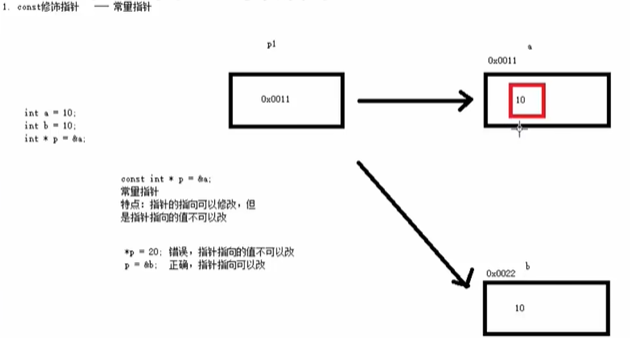
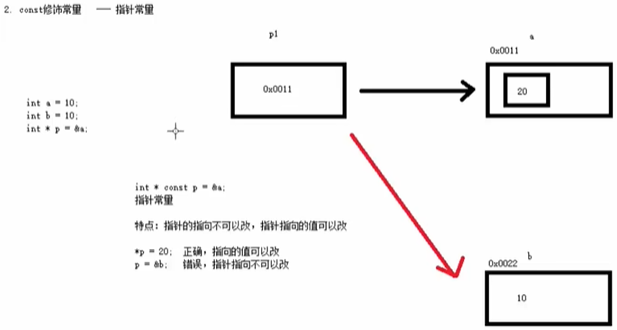
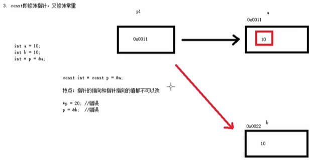

## 1 const 常量

```C++
//2、const修饰变量
const int month = 12;
```

不可以修改常量

## 2 字符串

### 2.1 字符型

**作用：**字符型变量用于显示单个字符

**语法：**`char ch = 'a';`

> 注意1：在显示字符型变量时，用单引号将字符括起来，不要用双引号

> 注意2：单引号内只能有一个字符，不可以是字符串

```C++
char ch = 'a';
cout << (int)ch << endl;  //查看字符a对应的ASCII码
```

### 2.2 字符串

```C++
int main() {
	// c语言风格
    char str1[] = "hello world";
    cout << str1 << endl;
    
    // C++风格
    string str = "hello world";
	cout << str << endl;
    system("pause");

    return 0;
}
```

## 3 数组

### 3.1 一维数组

```C++
//第二种定义方式
//数据类型 数组名[元素个数] =  {值1，值2 ，值3 ...};
//如果{}内不足10个数据，剩余数据用0补全
int score2[10] = { 100, 90,80,70,60,50,40,30,20,10 };

//定义方式3
//数据类型 数组名[] =  {值1，值2 ，值3 ...};
int score3[] = { 100,90,80,70,60,50,40,30,20,10 };
```

一维数组名称的**用途**：

1. 可以统计整个数组在内存中的长度
2. 可以获取数组在内存中的首地址

```C++
//数组名用途
//1、可以获取整个数组占用内存空间大小
int arr[10] = { 1,2,3,4,5,6,7,8,9,10 };

cout << "整个数组所占内存空间为： " << sizeof(arr) << endl;
cout << "每个元素所占内存空间为： " << sizeof(arr[0]) << endl;
cout << "数组的元素个数为： " << sizeof(arr) / sizeof(arr[0]) << endl;

//2、可以通过数组名获取到数组首地址
cout << "数组首地址为： " << (int)arr << endl;
cout << "数组中第一个元素地址为： " << (int)&arr[0] << endl;
cout << "数组中第二个元素地址为： " << (int)&arr[1] << endl;

//arr = 100; 错误，数组名是常量，因此不可以赋值
```

- 数组长度只能用sizeof(arr) / sizeof(arr[0])；

- 字符串长度可以用strlen(str)

### 3.2 二维数组

```C++
//方式2 
//数据类型 数组名[行数][列数] = { {数据1，数据2 } ，{数据3，数据4 } };
int arr2[2][3] =
{
	{1,2,3},
	{4,5,6}
};

//方式3
//数据类型 数组名[行数][列数] = { 数据1，数据2 ,数据3，数据4  };
int arr3[2][3] = { 1,2,3,4,5,6 }; 

//方式4 
//数据类型 数组名[][列数] = { 数据1，数据2 ,数据3，数据4  };
int arr4[][3] = { 1,2,3,4,5,6 };

cout << "二维数组行数： " << sizeof(arr) / sizeof(arr[0]) << endl;
cout << "二维数组列数： " << sizeof(arr[0]) / sizeof(arr[0][0]) << endl;
```

## 4 函数

函数的**声明可以多次**，但是函数的**定义只能有一次**

## 5 指针

```C++
//2、指针的使用
//通过*操作指针变量指向的内存
cout << "*p = " << *p << endl;
cout << *p << endl; //* 解引用
cout << sizeof(p) << endl;
cout << sizeof(char *) << endl;
cout << sizeof(float *) << endl;
cout << sizeof(double *) << endl;
```

总结：所有指针类型在32位操作系统下是4个字节，64位8个字节


### 5.1 空指针/野指针

**空指针**：指针变量指向内存中编号为0的空间

**用途：**初始化指针变量

**注意：**空指针指向的内存是不可以访问的

```C++
//指针变量p指向内存地址编号为0的空间
int * p = NULL;

//访问空指针报错 
//内存编号0 ~255为系统占用内存，不允许用户访问
cout << *p << endl;
```
**野指针**：指针变量指向非法的内存空间（未申请的空间）

```C++
//指针变量p指向内存地址编号为0x1100的空间
int * p = (int *)0x1100;

//访问野指针报错 
cout << *p << endl;
```

### 5.2 const修饰指针

const修饰指针有三种情况

1. const修饰指针   --- 常量指针



2. const修饰常量   --- 指针常量



3. const即修饰指针，又修饰常量




**示例：**


```c++
int main() {

	int a = 10;
	int b = 10;

	//const修饰的是指针，指针指向可以改，指针指向的值不可以更改
	const int * p1 = &a; 
	p1 = &b; //正确
	//*p1 = 100;  报错
	

	//const修饰的是常量，指针指向不可以改，指针指向的值可以更改
	int * const p2 = &a;
	//p2 = &b; //错误
	*p2 = 100; //正确

    //const既修饰指针又修饰常量
	const int * const p3 = &a;
	//p3 = &b; //错误
	//*p3 = 100; //错误

	system("pause");

	return 0;
}
```


> 技巧：看const右侧紧跟着的是指针还是常量, 是指针就是常量指针，是常量就是指针常量

### 5.3 指针与数组

p++表示指针向右移动**变量类型所占字节**个字节

```c++
    // 指针遍历数组
    int arr[] = {1, 2, 3, 4, 5};
    int *p3 = arr;
    for (int i = 0; i < 5; i++)
    {
        cout << *p3++ << endl; // 相当于p3++，再取值
    }
```

>  自增运算符、解引用运算符优先级相同，执行顺序从右到左

二维数组指针

```c++
int (*p)[4] = a;
```

### 5.4 函数的地址传递

**作用：**利用指针作函数参数，可以修改实参的值

**示例：**

```C++
//值传递
void swap1(int a ,int b)
{
	int temp = a;
	a = b; 
	b = temp;
}
//地址传递
void swap2(int * p1, int *p2)
{
	int temp = *p1;
	*p1 = *p2;
	*p2 = temp;
}

int main() {

	int a = 10;
	int b = 20;
	swap1(a, b); // 值传递不会改变实参

	swap2(&a, &b); //地址传递会改变实参

	cout << "a = " << a << endl;

	cout << "b = " << b << endl;

	system("pause");

	return 0;
}
```

## 6 结构体

**语法：**`struct 结构体名 { 结构体成员列表 }；`

通过结构体创建变量的方式有三种：

* struct 结构体名 变量名
* struct 结构体名 变量名 = { 成员1值 ， 成员2值...}
* 定义结构体时顺便创建变量

**示例：**

```C++
//结构体定义
struct student
{
	//成员列表
	string name;  //姓名
	int age;      //年龄
	int score;    //分数
}stu3; //结构体变量创建方式3 


int main() {

	//结构体变量创建方式1
	struct student stu1; //struct 关键字可以省略

	stu1.name = "张三";
	stu1.age = 18;
	stu1.score = 100;
	
	cout << "姓名：" << stu1.name << " 年龄：" << stu1.age  << " 分数：" << stu1.score << endl;

	//结构体变量创建方式2
	struct student stu2 = { "李四",19,60 };

	cout << "姓名：" << stu2.name << " 年龄：" << stu2.age  << " 分数：" << stu2.score << endl;


	stu3.name = "王五";
	stu3.age = 18;
	stu3.score = 80;
	

	cout << "姓名：" << stu3.name << " 年龄：" << stu3.age  << " 分数：" << stu3.score << endl;

	system("pause");

	return 0;
}
```

### 6.1 结构体数组

```c++
//结构体数组
struct student arr[3]=
{
	{"张三",18,80 },
	{"李四",19,60 },
	{"王五",20,70 }
};

// 可以单独修改
arr[2].name = "赵六";
```

### 6.2 结构体指针

**作用：**通过指针访问结构体中的成员

* 利用操作符 `-> `可以通过结构体指针访问结构体属性
* (*p).name也可以

```C++
struct student stu = { "张三",18,100, };
struct student * p = &stu;
p->score = 80; //指针通过 -> 操作符可以访问成员
```

### 6.3 结构体做函数参数

- 如果不想修改主函数中的数据，用值传递，反之用地址传递
- 值传递**直接复制一份**结构体
- 地址传递可以减少内存空间，而且不会复制，推荐使用

### 6.4 const结构体

```c++
//const使用场景
void printStudent(const student *stu) //加const防止函数体中的误操作
{
	//stu->age = 100; //操作失败，因为加了const修饰
}
```

